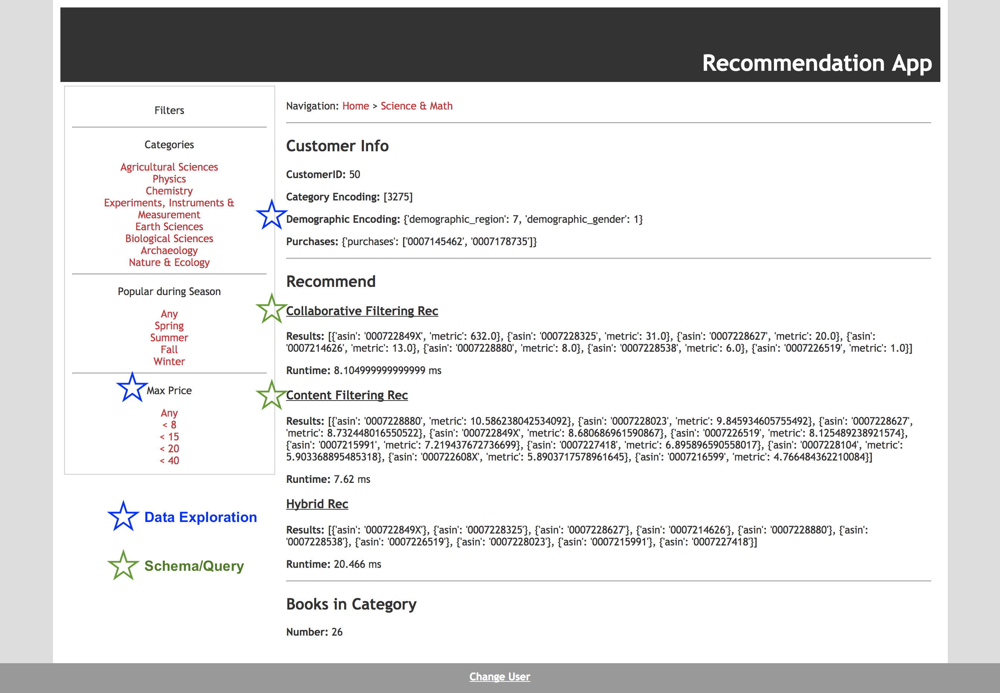

# Book Recommender ML Prototype 

Machine Learning Team

## Introduction
A recommender system is a system that attempts to predict the rating or preference that a user would give to an item. They are utilized in a variety of areas such as movies, music, news, books, research articles, search queries, social tags, and products in general. [1]

This project aims to develop a proof-of-concept recommender system for a bookstore client. A small set of customer and supplemental data was provided for this effort. For the ML team, a prototype system should be designed with scalable architecture, verifiable performance results, and integrate services from other teams (exploration, schema, query).

## Dataset
The sample data provided can be separated into two groups: customer information and supplemental information. Below is a brief description and examples of some of the data provided.

The customer information contains order information and personal information related to the customer. Sometimes personal information is missing for the customer.
* Books purchased
* Address
* Gender
* Name

The supplemental information contains region information and book information not directly related to the customer. 
* Region demographics
* Book reviews
* Categories

There is no direct relation between the book reviews and the customer purchases.

Some of the data has been extracted for offline analysis and encoding/derived data was also created for mocking up external endpoints. They can be found in the following location:
https://github.com/j-goldsmith/dse203-group-project/tree/master/machine_learning/data/extracts

# Requirements
The system should be capable of: 
* Output N recommendations in near real-time
* Model can be trained at X intervals
* Recommend books generally and when filtered by category, season * popularity, and price
* Do not recommend out of stock books

Based on the following assumptions:
* No link between reviewers
* All books have category info
* New customers may not have any demographics or history
* New books may not have any purchases/information
* New orders, books, reviews, customers, may enter the system

# Data Exploration
After performing some limited data exploration on the data, the following trends were noted:
* Large number of customers (~180k)
* Small number of books (~4k)
* Large number of orders (~190k)

Additionally, the Data Exploration APIs helped us to understand the distribution of different customer or book characteristics like book price, seasonal popularity, book ratings, customer demographics etc.

There was effort made to determine how to find customers will similar behaviors so different models could be created for each cluster. Customers can be associated to demographic cluster via their profile and purchase address. By leveraging profile features such as gender and median age demographic information, we can improve the clustering results. One example clustering can be seen below:

The price distribution api helped to change our price filter on the website to a more even distribution among different price ranges.

We also used the seasonal distribution api to look at the percentage of sales for books by season to determine the threshold to say the book is seasonal. We noticed a large spike for books in the 90-100% ranges meaning there are some books that had almost all of their sales in a certain season. Initially, we set our threshold to 40% thinking that a book can be popular in 2 seasons too; however, upon examining the distribution, we determined a book is seasonal if it’s popular only in 1 season. Based on this assumption, we selected the popularity threshold to be more than 50% of total sales. If a book has its total sales more than 50% in a certain season, it’s a seasonal book.

## Design
Based on the requirements, the following properties were identified as being important to the system:
* Accuracy
* Speed
* Scalability

There are two main approaches when building recommender systems:
* Collaborative Filtering uses past behaviors and similar decisions made by other users to make recommendations. However, large amounts of customer information is required to make accurate predictions. This method also suffers from the cold-start problem, where there is no user information. [2]
* Content Filtering uses characteristics of an item to make recommendations to additional items with similar properties. However, large amounts of item information is required to make accurate predictions. [2]

We came to the following initial conclusions after initial data exploration:
* Collaborative Filtering using the traditional user-user approach would likely have good accuracy performance due to the large amount of orders/purchases to train the model. However, there may be speed issues in quickly finding similar users due to the large amount of customers. The cold-start problem also would exist in this implementation since there may be new/exist users without any behaviors.
* Content Filtering using the traditional item similarity may have issues finding books with very similar properties since the set of books is quite small. There is a lack of attributes found in the supplemental data, where only reviews are available. There is no cold-start issue however.

Based on the conclusions above we developed a hybrid approach, where we used both models:
* Collaborative Filtering using an item-item approach, which should have comparable accuracy to the user-user approach with fast lookups but without the scaling issues since the number of books is quite small.
* Content Filtering using the traditional item similarity approach to deal with cold-start issues and augment collaborative filtering results when there are not enough recommendations.

For the collaborative model, we are implementing the item-item model using a co-occurrence matrix [5], which is a pre-processed lookup matrix to find books that are purchased together. To build this matrix, we use the customer order information to populate item-item pairs counts. There are some tuning considerations such as:
* What is the amount of data required for a model?
* Does a subset of like customer purchases make better models?

For the content model, we are implementing the item similarity model using multiple regression algorithms that predicted the helpfulness of a review and in turn predicted the final ranking. For the helpfulness, the following features were used:
* Price
* Number of users bought a book
* Review Length--
* Review Product Rating
* Total Votes for review
* Reviewers review count
* Review Age
* Number of reviews for product
* Avg word length --
* Number of words in Capital --
* Ratio of exclamations and question marks in review to total characters
* Avg Sentence length
* ARI index for review (Automated Readability Index)
* TF-IDF for top 100 features 

The below features will help us determine the final ranking of the books:
* Number of users bought a book
* Price
* Overall Rating from above model

The helpfulness index will be used weights to the product rating and come up with a single rating for each product. The tuning considerations that we will take into account:
* Do we need to randomize the recommendations and from what subset (otherwise all customers will have the same recommendation)?

For the hybrid model, we will be combining the collaborative filtering and content filtering models. For tuning considerations:
* What ratio do we want to use collaborative vs content filtering?

## Validation/Tuning
For recommendation systems, traditionally there are two main ways of doing validation/tuning on the model:
* Online involves using metrics such as high Customer Lifetime Values (CLV), A/B-testing, CTR, CR, ROI, and QA [3]
* Offline involves using metrics such as low prediction errors (RMSE/MAE) and high Recall/Catalog coverage [3]

Due to the nature of the prototype, where online testing will not be available, we focused on three main methods of validation/tuning:
* Recall is a type of accuracy measured by removing 1 or more purchased item from each customer and attempting to predict the removed items using the recommender system. The number of correct items predicted over the number removed is the recall.
* Catalog coverage is the number of unique items that a recommender system can recommend over the total number items in the catalog.
* Customer coverage is the percentage of customers covered by Top N books. This is mainly for content based filtering model.

For validation, the total purchase data was split into 80-20 validation/test subsets, the 80% subset was used to validate/tune the models using 10-fold cross validation. The 20% subset is the holdout set used to evaluate the final performance of the prototype.

For the Collaborative Filtering model, due to the process intensive testing, we looked for a way to minimize the required testing by reducing the data used for the model. We determined via validation that the model becomes more accurate with more data. Recall begins to taper off after 25k samples, but Catalog coverage is linear. After determining this, all the collaborative filtering validating was done with 25k samples or less.

There was time spent on determining if specialized Collaborative Filtering models were required for specific demographics to improve accuracy. We generated clusters using various features such as:
* gender,totalmales,totalfemales,totalpop
* totalspent,totalmales,totalfemales,totalpop
* Medianage,totalmales,totalfemales,totalpop
* Numorders,gender,totalpop,totalspent

After comparing the various clusters, we found that cluster 1 [gender, totalmales, totalfemales, totalpop] had the most performance improvements. We determined in cluster 1 that groups [1,3,4,7] should have specialized models since they were the ones that perform better than general model. Note that we prioritized recall accuracy over the content coverage metric in this case.

For Content Filtering, we did some analysis on the books and noticed that 70% of customers purchased at least one book in the top 300. This lead to making a decision of only recommending the top N books.

We then performed general recommendation validation. The image below shows the Top N books on x-axis and accuracy on y-axis. Each subplot shows the line graph for accuracy when X books are randomly picked from the Top N books. For example, in plot Pick 14 it shows that when you pick Top 40 books and then randomly choose 14 books from these 40, you get an accuracy of about 15%. Based on the results we decided that Top 40 makes most sense for general case. 

We also did validation for categories having more than 30 books, this helped us determine that a smaller set of top 20 recommendations and randomly picking X recommendations will have better accuracy. Below are the graphs to show results for a few categories. The 2 categories shown below are ‘History’ and ‘Engineering & Transportation’ respectively.

For the Hybrid Model, we tuned on what percentage we should mix the collaborative and content model recommendations. By using a default total recommendation of 10, after varying the amounts of each recommendation model, we found that a mix of 9 collaborative recommendations and 1 content recommendation gave better performance.

After tuning, the holdout set was used to generate results and we ended up with:
* Recall Accuracy: 22%
* Catalog Coverage: 50%

Note that from earlier, we determined that our Collaborative Filtering model had ~60% recall accuracy, while the Content Filtering had about ~10% recall accuracy. Since our testing methodology transforms all users that had 1 book purchase into users that had 0 book purchases, this reduced the recall accuracy significantly. Out of the ~180k customers, about ~130k had only 1 book purchase.

All these validation/tuning notebooks can be found in the following location:
https://github.com/j-goldsmith/dse203-group-project/tree/master/machine_learning/ValidationTests

## Reference Prototype Implementation
The prototype will allow for a visual real-time demonstration of our machine learning algorithms in addition to detailing our collaboration between the data (schema/query) and exploratory (data exploration) teams.

For correct operation of our prototype, we require two main types of queries from the integrated api (query team) which will translate our datalog queries to the underlying database (schema team):
* Model/Post queries are required to train/retrain the models and push them back up to the database:
    * General
        * Get Customer Purchases
        * Get Item information
    * Collaborative
        * Get Customer demographics
        * Post co-occurrence (this is done internally by the schema team)
    * Content
        * Get Item reviews
        * Post Item ranking
* Real-time queries are required to give the actual recommendation by accessing customer and model data stored in the underlying database:
    * General
        * Get Customer Purchases
    * Collaborative
        * Get Customer demographics
        * Get Item ranking
    * Content
        * Get Item ranking

Below is a notional diagram on how the Model/Post queries feed the underlying databases and the Real-time queries to feed the recommendation output.

We decided to implement the prototype as a website using python Flask this was due to the fact that python was familiar to everyone on the team and the framework’s lightweight/modular design allowed rapid iterations. 

The website has two main components:
* Restful api functions that give recommendations for:
    * General
    * Collaborative
    * Content
    * Hybrid 
* GUI that provides
    * Input data to restful api functions
    * Display
        * Input parameters
            * Customerid
            * Category, Popular Season, and Price Filters
        * Visualize Results
            * Collaborative, Content, Hybrid Results
                * Books recommended
                * Runtime
        * Books remaining in Category

There are two version of the website, one that uses external database connections and one that uses an internal data extract. They can both be found in the following location:
https://github.com/j-goldsmith/dse203-group-project/tree/master/machine_learning/demo

## Scalability Performance
One of the downsides of Flask is that it was never designed for large or asynchronous applications [4], so getting performance metrics is difficult:
* Internal data would be similar to having the data be stored in memory without indexes
* Flask rest calls are synchronous and blocking
* Flask uses local threads, which are limited due to access to only personal computers

Due to constraints of the setup, including no access to any hosting services. We thought meaningful might be obtained from generating large number of recommendations through our python model and looking at the performance. The following results were obtained by generating 100000 random recommender requests on a single thread and measuring the lengths of time for each request:
* Average response time: ~ 2 ms
* Requests per second: ~500

If the website is hosted externally in the future, it will be able to show the runtime of each recommender query, which will provide a metric of how well the system was implemented.

We explored several scenarios where increasing data would result in performance degradation and developed possible solutions that can be combined if necessary:
* General
	* Increase Processor speed and Memory of target servers
	* Apply modern load balancing techniques to reduce server load on any one instance
* Large increase in purchases
	* Randomly sample purchases instead of using all the purchase data to build co-occurrence matrices (collaborative)
* Large increase in new books, many books in each category
	* Split all items co-occurrence matrix (collaborative) into separate matrices per category or combination of categories
	* Build content rating lookups per category or combination of categories
* Large increase in reviews
	* Randomly sample reviews instead of using all the review data to build content rating lookups

    
## Challenges/Future Work
Several challenges were documented over the course of the work:
* Communicating between different groups
    * Requirements interpretation
    * Areas of responsibility
    * Availability of a testing interface
    * Schedule of deliverables
    * Issue resolution
* Addition/Changing requirements every other week
* Computing/hosting resource constrained
* Simultaneous development resulting in blockers

Based on the current results, we determined several areas of future development:
* Better customer clusters for building specialized co-occurrence matrices for the collaborative model
* Using current time for recommendations, i.e. seasonality information automatically applied
* Use historic predictions online results for tuning on model and having some feedback mechanism that automatically rebuilds the models
* Host the model externally to test scalability and performance in a more production like environment
* Additional validation/tuning using more categorical cases instead instead of just using general

## Source Code Summary
* Data
	* Extract [extracted source data)
	* Encode_Mappings [encoding lookups for non-numerical data]
	* Derived [new data derived from source]
	* Results [data to generate result visualizations]
* Notebooks
	* Create_Data [scripts to create derived data]
	* Data_Exploration [scripts to do data exploration using data exploration api]
	* Ingestion [scripts to ingest derived data into database]
	* Performance [scripts to test performance of algorithm]
	* Validation [scripts to do validation and holdout testing]
* Demo
	* Templates [demo webpage template]
	* Images [images for report]

## References

[1]https://en.wikipedia.org/wiki/Recommender_system

[2]http://homepages.abdn.ac.uk/advaith/pages/teaching/abdn.only/CS3017/lectures/

[3]https://medium.com/recombee-blog/evaluating-recommender-systems-choosing-the-best-one-for-your-business-c688ab781a35

[4]http://flask.pocoo.org/docs/0.12/design/

[5]https://disco.ethz.ch/courses/fs10/seminar/paper/michael-2.pdf
